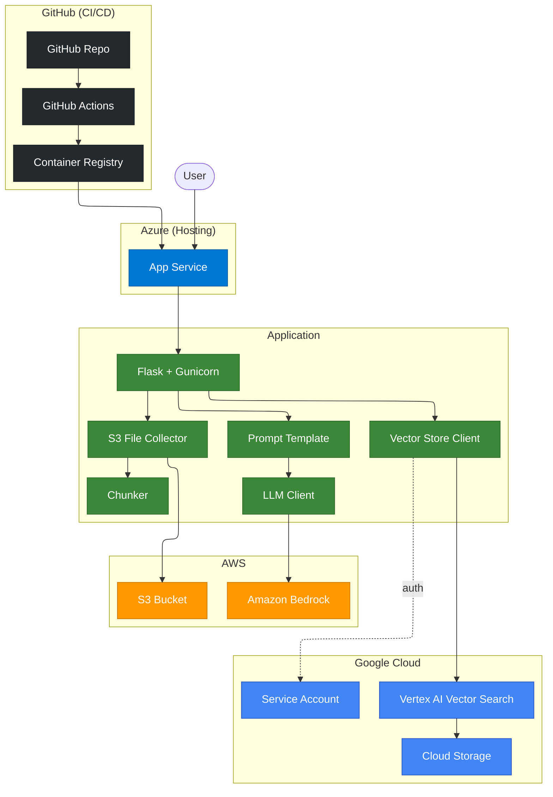

# RAG BSG: Proyecto 1 - RAG Serverless Multinube

- Para la version en español, click [aqui](/README_ES.md)
- [PDF File](/Proyecto 1 - Plataforma RAG Serverless Multinube.pdf)
- [Explanation Video]()

## Architecture Diagram (L3)



## Getting started

- Verify your python installation with `python3 --version` for mac or for windows: `python --version`
  - If not installed, you have to install [Python](https://www.python.org/downloads/)
- Verify pip is installed with `python3 -m pip --version` for mac or for windows: `python -m pip --version`
- Install "Python" and "Python Debugger" extensions in your IDE.

Then, run the following script in your terminal

For macOs/linux:

```shell
python3 -m venv .venv # create a virtual environment for your project
source .venv/bin/activate # activate the virtual environment in your project
```

For windows:

```shell
python -m venv .venv # create a virtual environment for your project
.venv\Scipts\activate # activate the virtual environment in your project
```

Then install the python dependencies with:
`pip install -r requirements.txt`

## Steps for deployment

### AWS

1. Create your account in [AWS](https://aws.amazon.com/free/)
2. Create your access key. This will help us with the interconnection of cloud providers. (Azure to AWS)
   1. Go to the menu on the top-right corner of your aws console screen.
   2. Click on "security credentials"
   3. Go to the "Access Keys" section
   4. Click on "Create Access Key"
   5. Copy all the values on a notepad or text editor or environment variables file. (follow the `.env.sample` file)
3. Create an S3 bucket. This will help us store our knowledge base
   1. Setup a namespace for the bucket.
   2. Disable ACLs.
   3. Block public access.
   4. Disable bucket versioning.
   5. Select default encryption.
   6. Disable Object lock.
4. For the Bedrock Model, you need to submit a use case for first time usage. (If you have already used anthropic models on your AWS, you do not need to follow these steps)
   1. Go to Amazon Bedrock.
   2. Find the "Model catalog" option on the left panel.
   3. Select any Anthropic model.
   4. A notification will appear at the top, asking you to fill a use case. Click there and fill the use case form.

### Github

1. Create your account in [Github](https://github.com/)
2. Create a Personal Access Token
   1. Click on your profile icon at the top-right corner of the page
   2. Click on the "Settings" option once the menu pops-up
   3. Click on "Developer Settings" on the left menu at the bottom
   4. Click on "Personal Access Tokens" on the left menu at the bottom
   5. Click on "Tokens (classic)"
   6. Click on the "Generate new token" button at the top-right corner of the page.
   7. Click on the "Generate new token (classic)" option.
   8. Give the token a name.
   9. Mark the "repo" and "read:packages" permissions.
   10. Click on "Generate token" button at the bottom.
   11. Copy the Personal Access Token generated in your favorite text editor.

### Azure

1. Create your [Azure](https://portal.azure.com) account.
2. Create a Subscription (name it however you want)
3. Create a Resource Group inside the Subscription created in step 2 (name it however you want)
   1. Select the region most convenient to you (e.g. south central US)
4. Create an App Service
   1. Select just "Web App" when you click on the create button.
      1. Select the Subscription and Resource Group created on steps 2 and 3 respectively
      2. Name your webapp however you want.
      3. Select the option "Container" on the Publish field (radio button)
      4. Select operating system, by default and conveniently is linux.
      5. Select the region most convenient to you (e.g. south central US)
      6. Select the linux plan, or create a new one if you dont have one.
      7. Select the pricing plan. (For this project I'll select "Free F1")
   2. Click "Next: Database >"
      1. DO NOT create a database.
   3. Click "Next: Container >"
      1. Disable Sidecar support.
      2. Select image source: other container registries.
      3. Access type: Private
      4. Registry server URL: https://ghcr.io
      5. Username: <your_github_username>
      6. Password: <pat_created_on_github_section>
      7. Image and tag: <name_of_your_docker_container>:<version>
      8. Startup command: gunicorn app:app
   4. Click "Next: Networking >"
      1. Enable public access.
   5. Click "Next: Monitor + secure >"
   6. Click "Next: Tags >". (Optionally add the tags you want).
   7. Click "Next: Review + create >"
      1. Review the settings you entered and finally click "Create".
   8. Go to your newly created web app from your home portal.
      1. Open the Settings tree node at the left.
      2. Click on Configuration.
      3. Make sure the "SCM Basic Auth Publishing Credentials" and "FTP Basic Auth Publishing Credentials" options are enabled. (the first two options on the panel)
      4. Click on "Apply" button at the bottom.
      5. Click on the "Overview" Option at the left.
      6. Click on "Download publish profile" from the Overview Screen at the top.
      7. Save the file where you prefer.
   9. Setup environment variables
      1. Find and click the "Settings" option on the left pane.
      2. Find and click the "Environment variables" option below.
      3. Make sure to configure the environment variables detailed on the `.env.sample` file.

### Github & Github Actions

1. Go to you repository Settings.
   1. Create necessary Secrets
      1. Look and click for the "Secrets and Variables" option at the left.
      2. Click on the "Actions" suboption.
      3. Click on the "New repository secret" button.
      4. The new secret should be named `AZURE_WEBAPP_PUBLISH_PROFILE`.
      5. Copy the contents of the publish profile file from the last section and click on "Add secret".
      6. Now everytime you push to the main (or default) branch, your container will be built and deployed to your azure web app.
   2. Give Permissions to the Actions workflow
      1. Find and click the "Actions" option at the left side of the settings page.
      2. Click on the "General" suboption.
      3. Find the "Workflow permissions" section.
      4. Enable the "Read and write permissions" option.
      5. Click on save.

### Google Cloud

1. Open [Google Cloud Platform](https://console.cloud.google.com/) and create an account
2. On the top left corner, you'll see the project button, Click on it and create a project.
3. API Keys & Service account
   1. On the search bar, type Service Account and go there.
   2. At the top of the page, theres a button named "Create Service Account". Click on it.
   3. Give your service account a name, an id will be automatically assigned based on the given name.
   4. Click on "Create and close" button at the bottom.
   5. Add key.
      1. Identify the row of your newly created service account and click on the 3 dots at the right of the table.
      2. Click on the "Manage Keys" option.
      3. Click on "Add key" at the bottom and select "Create new key".
      4. Select "JSON" on the pop up and click "Create". Save the file in the location of your preference.
      5. Encode the file contents into a base64 encoding. Copy the encoded value in the `GOOGLE_SA_CREDENTIALS_BASE64` environment variable. (Make sure you use a safe, non-online encoder)
   6. Add Roles.
      1. Click on the "Permissions" tab.
      2. Click on "Manage Access" button.
      3. Look for the "Storage Object User" role and select that role.
      4. Click on "Add another role" button.
      5. Look for the "Vector Search Service Agent" role and select that role.
      6. Click on "Add another role" button.
      7. Look for the "Vertex AI RAG Data Service Agent" role and select that role.
      8. Click on Save.
4. Google Cloud Storage (GCS)
   1. On the search bar, type GCS and go there.
   2. Create a new bucket and give it a name. Click on "Continue"
   3. Select single region and select a region (preferrably to have a low CO2 emission and nearby the regions selected in Azure/AWS). Click on continue
   4. Enable Hierarchical namespace. Click on Continue
   5. Disable public access and Uniform Access Control. Click on continue.
   6. Disable Soft delete policy, object versioning, bucket retention policy. Click on Create.
5. Vector Search
   1. On the search bar, type Vector Search and go there.
   2. If you dont have them enabled, a notification will pop up. Click on Enable API's and enable the API's marked as disabled.
   3. Select the same region you selected on step 4.3.
   4. Create an Index
      1. Click on "Create new index". Fill the required fields.
      2. Select a GCS folder.
      3. On the dimensions field, type in 128. (This applies for the selected model)
      4. On the "Approximate neighbors count" field, type in 500. (top-k parameter)
      5. On the "Update method" field, select Batch.
      6. On the "Shard Size" field, select Small.
      7. Click on "Create" button at the bottom.
   5. Create index endpoints
      1. Click on the tab at the top that says "Index endpoints"
      2. Click on "Create new endpoint".
      3. Write a name for your endpoint.
      4. Select "Standard".
      5. Click on "Create".
   6. Deploy index.
      1. Go to the "Indexes" tab again.
      2. On the row that appears your newly created index on step 4, you'll see the "Deploy" button, click there.
      3. Write a name for your deployment.
      4. Select the index endpoint created in step 5
      5. Choose Standard machine type.
      6. Enable autoscaling
      7. In minimum number of replicas, type in 1.
      8. In maximum number of replicas, type in 1.
      9. Click on "Deploy". (This step will take longer than 15 minutes.)
   7. Fill the remaining secrets. Make sure you fill all the secrets that start with `GOOGLE` or `GCP` to start using this.
6. Done, now you have everything you need for the deployment of this project. Make sure to commit your changes to the default branch of your repo so you can see the changes live on the internet.
