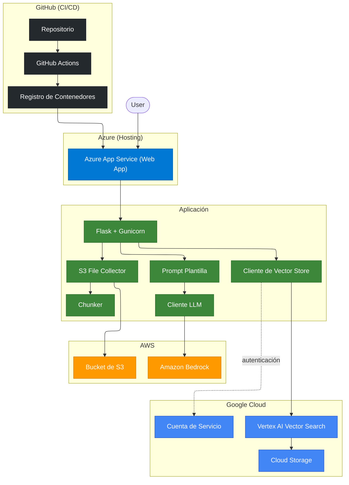

# RAG BSG: Proyecto 1 - RAG Serverless Multinube

## Diagrama de Arquitectura (L3)



## Primeros pasos

- Verifica tu instalación de Python con `python3 --version` para Mac o, para Windows: `python --version`.
  - Si no está instalado, debes instalar [Python](https://www.python.org/downloads/).
- Verifica que pip esté instalado con `python3 -m pip --version` para Mac o, para Windows: `python -m pip --version`.
- Instala las extensiones "Python" y "Python Debugger" en el IDE de tu preferencia.

Luego, ejecuta el siguiente script en tu terminal:

Para macOs/linux:

```shell
python3 -m venv .venv # crear un ambiente virtual para tu proyecto
source .venv/bin/activate # activar el ambiente virtual en tu proyecto
```

Para windows:

```shell
python -m venv .venv # crear un ambiente virtual para tu proyecto
.venv\Scipts\activate # activar el ambiente virtual en tu proyecto
```

Luego instala las dependencias de Python con:
`pip install -r requirements.txt`

## Pasos para el despliegue

### AWS

1. Crea tu cuenta en [AWS](https://aws.amazon.com/free/)
2. Crea tu clave de acceso. Esto nos ayudará con la interconexión de proveedores de nube (Azure a AWS)
   1. Ve al menú en la esquina superior derecha de la pantalla de tu consola de AWS
   2. Haz clic en credenciales de seguridad (security credentials)
   3. Ve a la sección de Claves de Acceso (Access Keys)
   4. Haz clic en Crear Clave de Acceso (Create Access Key)
   5. Copia todos los valores en un bloc de notas, editor de texto o archivo de variables de entorno (sigue el ejemplo en el archivo `.env.sample`)
3. Crea un bucket de S3. Esto nos ayudará a almacenar nuestra base de conocimientos
   1. Configura un espacio de nombres (namespace) para el bucket
   2. Desactiva las ACLs
   3. Bloquea el acceso público (public access)
   4. Desactiva el control de versiones del bucket (bucket versioning)
   5. Selecciona el cifrado predeterminado (default encryption)
   6. Desactiva el bloqueo de objetos (Object lock)
4. Para el modelo de Bedrock, debes enviar un caso de uso para el primer uso. (Si ya has utilizado modelos de Anthropic en tu AWS, no es necesario seguir estos pasos)
   1. Ve a "Amazon Bedrock"
   2. Busca la opción "Catálogo de modelos" (Model catalog) en el panel izquierdo
   3. Selecciona cualquier modelo de Anthropic
   4. Aparecerá una notificación en la parte superior pidiéndote que completes un caso de uso. Haz clic allí y completa el formulario del caso de uso

### Github

1. Crea tu cuenta en [Github](https://github.com/)
2. Crea un Token de Acceso Personal (PAT) (Clásico) en GitHub
   1. Clickea en tu icono de perfil en la esquina superior derecha
   2. Clickea en la opcion de Configuracion (Settings)
   3. Clickea en la opcion de Configuracion de Desarrolladores (Developer Settings) hasta abajo en el menu de la izquierda
   4. Clickea en la opcion de Tokens de Acceso Personal (Personal Access Tokens) en el menu de la izquierda
   5. Clickea en Token clásica (Tokens (classic))
   6. Clickea en el botón de "Generar token nueva" (Generate new token) en la esquina superior derecha
   7. Clickea en la opcion de "Generar nueva token clásica" (Generate new token (classic)).
   8. Dale un nombre a tu token.
   9. Marca los permisos de "repo" y "read:packages".
   10. Clickea en el botón de "Generar token" (Generate token) hasta abajo.
   11. Copia la Token personal de acceso en el editor de texto de tu preferencia

### Azure

1. Crea tu cuenta de [Azure](https://portal.azure.com).
2. Crea una Suscripción (nómbrala como desees)
3. Crea un Grupo de Recursos (Resource Group) dentro de la Suscripción creada en el paso 2 (nómbralo como desees)
   1. Selecciona la región que te resulte más conveniente (por ejemplo, south central US)
4. Crea un App Service
   1. Selecciona simplemente "Web App" cuando hagas clic en el botón de crear
      1. Selecciona la Suscripción y el Grupo de Recursos creados en los pasos 2 y 3 respectivamente
      2. Nombra tu webapp como desees
      3. Selecciona la opción "Contenedor" (Container) en el campo Publicar (botón de radio)
      4. Selecciona el sistema operativo; por defecto y convenientemente es Linux
      5. Selecciona la región más conveniente para ti (por ejemplo, south central US)
      6. Selecciona el plan de Linux, o crea uno nuevo si no tienes uno
      7. Selecciona el plan de precios (Para este proyecto seleccionaré "Free F1")
   2. Haz clic en "Siguiente: Base de datos >"
      1. NO crees una base de datos
   3. Haz clic en "Siguiente: Contenedor >"
      1. Desactiva el soporte de Sidecar
      2. Selecciona la fuente de la imagen: otros registros de contenedores (other container registries)
      3. Tipo de acceso: Privado
      4. URL del servidor de registro: https://ghcr.io
      5. Nombre de usuario: <tu_nombre_de_usuario_de_github>
      6. Contraseña: <pat_creado_en_la_seccion_de_github>
      7. Imagen y etiqueta: <nombre_de_tu_contenedor_docker>:<version>
      8. Comando de inicio: gunicorn app:app
   4. Haz clic en "Siguiente: Redes >"
      1. Habilita el acceso público
   5. Haz clic en "Siguiente: Monitoreo + seguridad >"
   6. Haz clic en "Siguiente: Etiquetas >" (Opcionalmente, añade las etiquetas que desees)
   7. Haz clic en "Siguiente: Revisar + crear >"
      1. Revisa la configuración que ingresaste y finalmente haz clic en "Crear"
   8. Ve a tu aplicación web recién creada desde tu portal de inicio
      1. Abre el nodo del árbol de Configuración (Settings) a la izquierda
      2. Haz clic en Configuración (Configuration)
      3. Asegúrate de que las opciones "SCM Basic Auth Publishing Credentials" y "FTP Basic Auth Publishing Credentials" estén habilitadas (las dos primeras opciones del panel)
      4. Haz clic en el botón "Aplicar" (Apply) en la parte inferior
      5. Haz clic en la opción "Información general" (Overview) a la izquierda
      6. Haz clic en "Descargar perfil de publicación" (Download publish profile) desde la pantalla de Información general en la parte superior
      7. Guarda el archivo donde prefieras
   9. Configurar variables de entorno
      1. Busca y haz clic en la opción "Configuración" (Settings) en el panel izquierdo
      2. Busca y haz clic en la opción "Variables de entorno" (Environment variables) debajo
      3. Asegúrate de configurar las variables de entorno detalladas en el archivo `.env.sample`

### Github & Github Actions

1. Ve a la configuración de tu repositorio (Repository Settings)
   1. Crea los Secretos necesarios
      1. Busca y haz clic en la opción "Variables y Secretos" (Secrets and Variables) a la izquierda.
      2. Haz clic en la subopción "Actions".
      3. Haz clic en el botón "Nuevo secreto de repositorio" (New repository secret).
      4. El nuevo secreto debe nombrarse `AZURE_WEBAPP_PUBLISH_PROFILE`.
      5. Copia el contenido del archivo del perfil de publicación de la última sección y haz clic en "Add secret".
      6. Ahora, cada vez que realices un push a la rama principal (o predeterminada), tu contenedor se construirá y se desplegará en tu aplicación web de Azure.
   2. Otorga permisos al flujo de trabajo de Actions
      1. Busca y haz clic en la opción "Actions" en el lado izquierdo de la página de configuración
      2. Haz clic en la subopción "General"
      3. Busca la sección "Workflow permissions"
      4. Habilita la opción "Read and write permissions"
      5. Haz clic en "Guardar" (Save)

### Google Cloud

1. Abre Google Cloud Platform y crea una cuenta
2. En la esquina superior izquierda, verás el botón del proyecto; haz clic en él y crea un proyecto
3. Claves de API y cuenta de servicio
   1. En la barra de búsqueda, escribe Cuenta de Servicio (Service Account) y ve allí.
   2. En la parte superior de la página, hay un botón llamado "Crear cuenta de servicio". Haz clic en él.
   3. Dale un nombre a tu cuenta de servicio; se asignará automáticamente un ID basado en el nombre dado.
   4. Haz clic en el botón "Crear y cerrar" en la parte inferior.
   5. Añadir clave.
      1. Identifica la fila de tu cuenta de servicio recién creada y haz clic en los 3 puntos a la derecha de la tabla.
      2. Haz clic en la opción "Administrar claves".
      3. Haz clic en "Añadir clave" en la parte inferior y selecciona "Crear nueva clave".
      4. Selecciona "JSON" en la ventana emergente y haz clic en "Crear". Guarda el archivo en la ubicación de tu preferencia.
      5. Codifica el contenido del archivo en formato base64. Copia el valor codificado en la variable de entorno `GOOGLE_SA_CREDENTIALS_BASE64` (Asegúrate de usar un codificador seguro y que no sea en línea).
   6. Añadir Roles
      1. Haz clic en la pestaña "Permisos" (Permissions)
      2. Haz clic en el botón "Administrar acceso" (Manage Access)
      3. Busca el rol "Storage Object User" y selecciónalo
      4. Haz clic en el botón "Añadir otro rol"
      5. Busca el rol "Vector Search Service Agent" y selecciónalo
      6. Haz clic en el botón "Añadir otro rol"
      7. Busca el rol "Vertex AI RAG Data Service Agent" y selecciónalo
      8. Haz clic en Guardar
4. Google Cloud Storage (GCS)
   1. En la barra de búsqueda, escribe GCS y ve allí
   2. Crea un nuevo bucket y dale un nombre. Haz clic en "Continuar"
   3. Selecciona región única y elige una región (preferiblemente que tenga una baja emisión de CO2 y esté cerca de las regiones seleccionadas en Azure/AWS). Haz clic en continuar
   4. Habilita el espacio de nombres jerárquico. Haz clic en Continuar
   5. Desactiva el acceso público y el Control de Acceso Uniforme. Haz clic en continuar
   6. Desactiva la política de eliminación suave (Soft delete), el control de versiones de objetos y la política de retención del bucket. Haz clic en Crear
5. Búsqueda de Vectores (Vector Search)
   1. En la barra de búsqueda, escribe Vector Search y ve allí
   2. Si no las tienes habilitadas, aparecerá una notificación. Haz clic en Habilitar APIs y activa las APIs marcadas como desactivadas
   3. Selecciona la misma región que seleccionaste en el paso 4.3
   4. Crea un Índice
      1. Haz clic en "Crear nuevo índice". Completa los campos requeridos
      2. Selecciona una carpeta de GCS
      3. En el campo de dimensiones, escribe 768 (Esto aplica para el modelo seleccionado)
      4. En el campo "Approximate neighbors count", escribe 50 (parámetro top-k)
      5. En el campo "Update method", selecciona Stream
      6. Haz clic en el botón "Crear" en la parte inferior
   5. Crea endpoints de índice
      1. Haz clic en la pestaña superior que dice "Index endpoints"
      2. Haz clic en "Create new endpoint"
      3. Escribe un nombre para tu endpoint
      4. Selecciona "Standard"
      5. Haz clic en "Crear"
   6. Desplegar índice
      1. Ve a la pestaña "Indexes" de nuevo
      2. En la fila donde aparece tu índice recién creado en el paso 4, verás el botón "Deploy"; haz clic allí
      3. Escribe un nombre para tu despliegue
      4. Selecciona el endpoint de índice creado en el paso 5
      5. Elige el tipo de máquina Standard
      6. Habilita el autoescalado
      7. En el número mínimo de réplicas, escribe 1
      8. En el número máximo de réplicas, escribe 5
      9. Haz clic en "Deploy". (Este paso tardará más de 15 minutos)
   7. Llena los secretos faltantes. Asegurate de llenar todos los secretos que empiecen con `GOOGLE` o `GCP` para empezar a usar estos servicios.
      1. Vete a tu web app creada en azure y ve a la seccion de variables de ambiente.
      2. Copia cada valor de tu archivo `.env.sample` al portal de azure.
6. Listo! ahora tienes todo lo necesario para el despliegue de este proyecto. Asegúrate de confirmar tus cambios en la rama predeterminada de tu repositorio para que puedas ver los cambios en vivo en internet.
